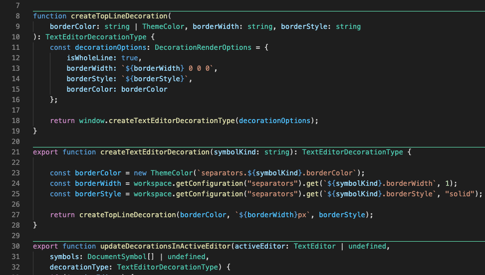

[](https://marketplace.visualstudio.com/items?itemName=alefragnani.separators)
[](https://marketplace.visualstudio.com/items?itemName=alefragnani.separators)
[](https://marketplace.visualstudio.com/items?itemName=alefragnani.separators)
[](https://github.com/alefragnani/vscode-separators/actions?query=workflow%3ACI)

<p align="center">
  <br />
  <a title="Learn more about Separators" href="http://github.com/alefragnani/vscode-separators"></a>
</p>

# What's new in Separators 2.0

* Adds support for more symbols
* Allows to select which symbols shows separators
* Default separator color follows symbol icon color

## Support

**Separators** is an open source extension created for **Visual Studio Code**. While being free and open source, if you find it useful, please consider supporting it.

<table align="center" width="60%" border="0">
  <tr>
    <td>
      <a title="Paypal" href="https://www.paypal.com/cgi-bin/webscr?cmd=_donations&business=EP57F3B6FXKTU&lc=US&item_name=Alessandro%20Fragnani&item_number=vscode%20extensions&currency_code=USD&bn=PP%2dDonationsBF%3abtn_donate_SM%2egif%3aNonHosted"></a>
    </td>
    <td>
      <a title="Paypal" href="https://www.paypal.com/cgi-bin/webscr?cmd=_donations&business=EP57F3B6FXKTU&lc=BR&item_name=Alessandro%20Fragnani&item_number=vscode%20extensions&currency_code=BRL&bn=PP%2dDonationsBF%3abtn_donate_SM%2egif%3aNonHosted"></a>
    </td>
    <td>
      <a title="Patreon" href="https://www.patreon.com/alefragnani"></a>
    </td>
  </tr>
</table>

# Separators

It improves the readability of your source code, by drawing lines on top of each symbol. 



Here are some of the features that **Separators** provides:

* Customize the separators appearance
* Each kind of symbol can have its own customization
* Select which symbols will have separators

# Features

## Available commands

* `Separators: Toggle Visibility` 
* `Separators: Select Symbols` 

## Available settings

You can customize the appearance of each kind of Symbol. 

* List of symbols in which the separators will be drawn
    ```json
    "separators.enabledSymbols": [ 
      "Classes", 
      "Constructors",
      "Enums", 
      "Functions",
      "Interfaces", 
      "Methods",
      "Namespaces"
    ],
    ```

* Defines the border width _(in `px`)_
    ```json
    "separators.classes.borderWidth": 1,
    "separators.constructors.borderWidth": 1, 
    "separators.enums.borderWidth": 1,
    "separators.functions.borderWidth": 1, 
    "separators.interfaces.borderWidth": 1,
    "separators.methods.borderWidth": 1, 
    "separators.namespaces.borderWidth": 1,
    ```

* Define how border style _(choose between `solid`, `dotted`, `dashed` or `double`)_
    ```json
    "separators.classes.borderStyle": "solid",
    "separators.constructors.borderStyle": "solid",
    "separators.enums.borderStyle": "solid",
    "separators.functions.borderStyle": "solid",
    "separators.interfaces.borderStyle": "solid",
    "separators.methods.borderStyle": "solid",
    "separators.namespaces.borderStyle": "solid",
    ```

> Starting in v2.0 the separators for each symbol kind will use the corresponding `symbolIcon` color as new default. If you want `Methos`, `Functions` and `Constructors` to keep using the original _greenish_ color (`#65EAB9`) from v1.0, update the new `separators.useOriginalGreenishSeparator` setting to `true`.

## Available colors

For more information about customizing colors in VSCode, see [Theme Color](https://code.visualstudio.com/api/references/theme-color).

* Choose the color of the border 
```json
    "workbench.colorCustomizations": {
      "separators.classes.borderColor": "#65EAB9",  
      "separators.constructors.borderColor": "#65EAB9",  
      "separators.enums.borderColor": "#65EAB9",  
      "separators.functions.borderColor": "#65EAB9",  
      "separators.interfaces.borderColor": "#65EAB9",  
      "separators.methods.borderColor": "#65EAB9",  
      "separators.namespaces.borderColor": "#65EAB9",  
    }
```

# License

[MIT](LICENSE.md) &copy; Alessandro Fragnani