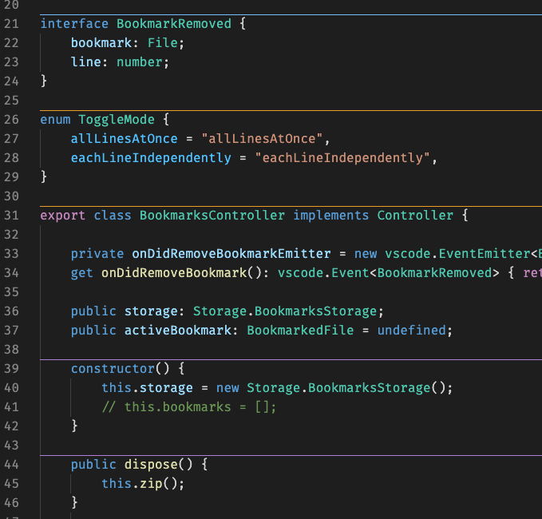

## Avtomatik aşkarlama

Genişlənmə quraşdırdığın dil genişlənmələrinin dəstəklədiyi bütün dillər üçün ayırıcıları avtomatik çəkir. Bunun üçün cari faylın dilini aşkarlayır və ayırıcıları həmin dilə uyğun tətbiq edir.

> İpucu: İstədiyin dilin Separators ilə işləyəcəyini bilmək üçün VS Code daxilindəki `Outline` görünüşünə bax. Orada məzmun göstərilirsə, Separators problemsiz işləyəcək.