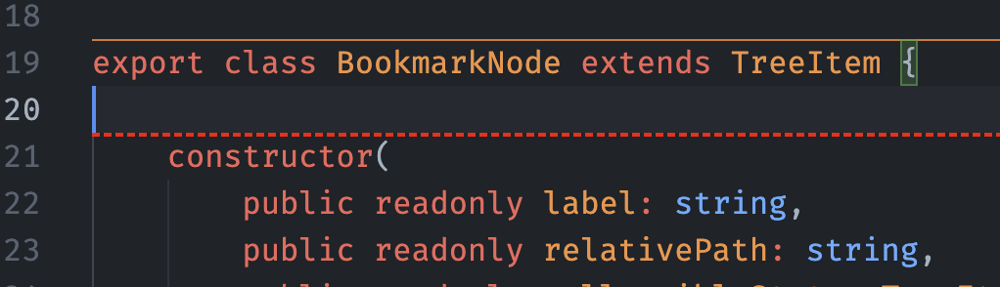

## Customizing Appearance

You can customize a few characteristics of the separator, beyond the colors.

Something like this in your settings:

```json
    "separators.constructors.borderStyle": "dashed",
    "separators.constructors.borderWidth": 2,
```

And this to customize the color:

```json
    "workbench.colorCustomizations": {
      ...
      "separators.constructors.borderColor": "#FF0000"
    }
```

Could end up with a separator like this:



And the same customization is possible on a language level. To do that, you need to add the language identifier to the setting. For example, to customize the appearance of the separator for JavaScript, you can use:

```json
    "separators.javascript.borderStyle": "dashed",
    "separators.javascript.borderWidth": 2,
    "separators.javascript.borderColor": "#FF0000"
```