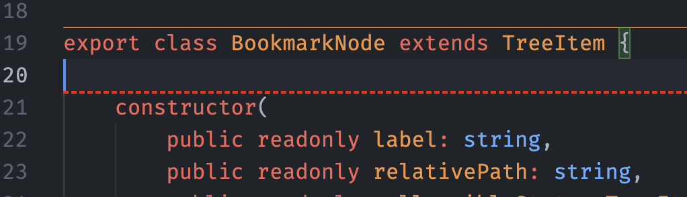

## Görünüşü fərdiləşdir

Rənglərdən əlavə, ayırıcının bir neçə başqa xüsusiyyətini də fərdiləşdirə bilərsən.

Ayarlarında buna bənzər bir konfiqurasiya:

```json
    "separators.constructors.borderStyle": "dashed",
    "separators.constructors.borderWidth": 2,
    "workbench.colorCustomizations": {
      ...
      "separators.constructors.borderColor": "#FF0000"
    }
```

Belə bir ayırıcı yarada bilər:



> İpucu: Bəzi konfiqurasiyalar dilə xas ayarları dəstəkləyir, məsələn, `separators.minimumLineCount`