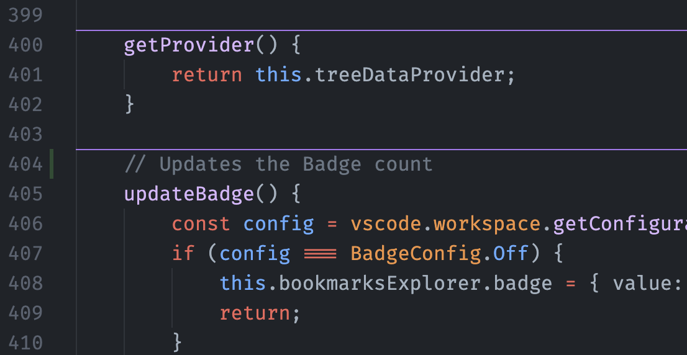

## Customizing Location

By default, the separators are located above the symbol. But you can choose where the separators will be drawn:

| Option                 | Behavior                                                   |
|------------------------|------------------------------------------------------------|
| `aboveTheSymbol`       | A single separator located above the symbol                |
| `aboveTheComment`      | A single separator located above the comment of the symbol |
| `belowTheSymbol`       | A single separator located below the symbol                |
| `surroundingTheSymbol` | A pair of separators located above and below the symbol    |

Something like this in your settings:

```json
    "separators.location": "aboveTheComment"
```

Could end up with a separator like this:

