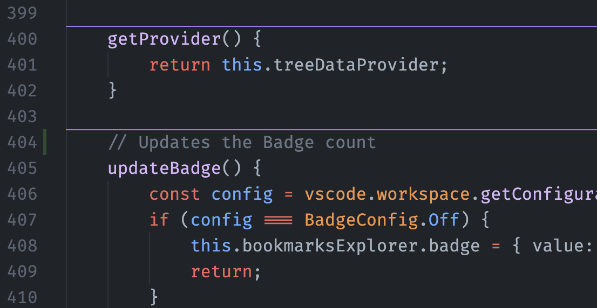

## Yerləşməni fərdiləşdir

Standart olaraq, ayırıcılar simvolun üstündə yerləşir. Ayırıcıların harada çəkiləcəyini seçə bilərsən:

| Seçim                 | Davranış                                                   |
|------------------------|------------------------------------------------------------|
| `aboveTheSymbol`       | Simvolun üstündə yerləşən tək ayırıcı                |
| `aboveTheComment`      | Simvolun şərhinin üstündə yerləşən tək ayırıcı |
| `belowTheSymbol`       | Simvolun altında yerləşən tək ayırıcı                |
| `surroundingTheSymbol` | Simvolun üstündə və altında yerləşən bir cüt ayırıcı    |

Ayarlarında buna bənzər bir konfiqurasiya:

```json
    "separators.location": "aboveTheComment"
```

Belə bir ayırıcı yarada bilər:

