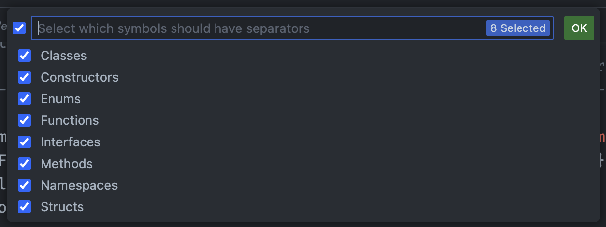

## Select Symbols

You can choose which symbols will have Separators. To do so, execute the `Separators: Select Symbols` command and choose the symbols.

> Tip: On the right side of each symbol name, there will be a gear icon, which points you to the setting of that symbol.