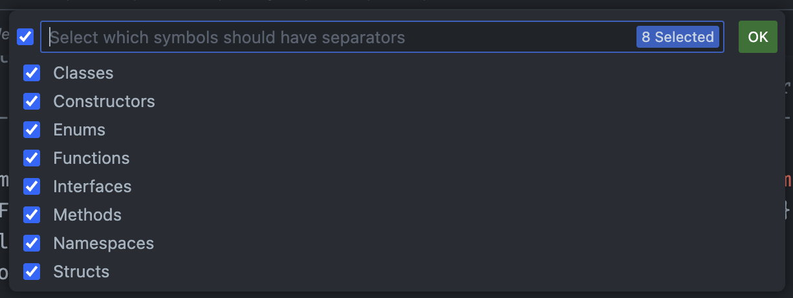

## Simvolları seç

Hansı simvollar üçün Separators ayırıcılarının göstəriləcəyini seçə bilərsən. Bunun üçün `Separators: Select Symbols` əmrini icra et və simvolları seç.

> İpucu: Hər simvolun adının sağ tərəfində dişli çarx işarəsi var. Bu işarə səni həmin simvolun ayarına yönləndirir.